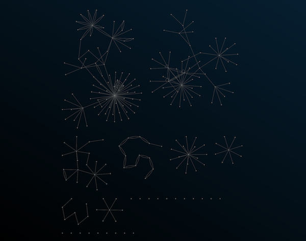

# Foam MRI

A play on fMRI. Discover functional pathways in your *second* brain.

## Packages Included:
 - Foam Notebook Export - a tool for exporting Foam Notebooks to JSON
 - Form MRI App - A tool for visualizing Foam Notebooks

## Introduction & Philosophy
The concept of [Zettelkasten](https://en.wikipedia.org/wiki/Zettelkasten), or a *second brain*, is becoming increasingly popular in digital note-taking systems and applications. The ability to backlink between notes and visualize the connections between notes is now common and something that I personally look for in a note-taking app. 

However, a simple graph visualization of notes does not always capture the features I would consider important to a second brain. 

For an example, here's my Roam Research notes graph:

This visualization displays links between notes and how many links a given note has (size of node). This visualization is great, but a Zettelkasten is only able to improve your creativity when you start to find the **connections** between nodes and make **new** connections. 

So I decided to create a tool that performs a fuzzy search on all notes contained within a Zettelkasten-style note-taking app (Foam in this instance). 

Say I want to find all of my notes that contain the term "functional programming" and see how they connect. With Foam MRI that's as simple as pressing "space" to open up the searchbar and entering query terms. A heatmap of connections is created that allows a user to navigate existing thoughts that contain these terms and ideally find unrelated thoughts which can be connected creatively. 

# Foam Notebook Export
A tool for exporting a foam networked notebook to JSON.

# Foam MRI
### A tool for searching your foam notebook and discovering hidden connections between notes.

Similar to Roam and Foam, Foam-MRI allows for simple note graphing and previewing.

 
 

Users can also search their notes to discover how ideas connect and map the toplogy of their thoughts.

 
 

